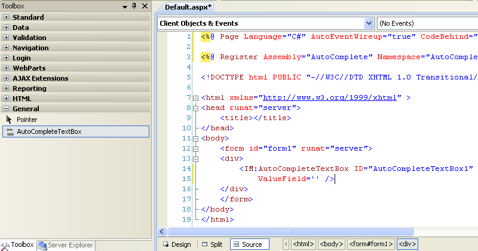
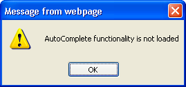

## Why AutoComplete.Net?

This library contains a WebControl and a bunch of **HtmlHelper** extension methods.
Their purpose is to provide developers with an easy interface to the cool JQuery UI autocomplete Widget.

## How To Get It

Just download the latest version of AutoComplete.Net (a zip package containing the binary and few other files).
Unzip the release package wherever you want, e.g. under _C:\Program Files\AutoComplete.Net_.
For most of the time you will need only the _AutoComplete.dll_ but in the following paragraphs you will be instructed about when you will need the other files included in the release package.

# Quick Start Guide

[Asp.Net](#aspnet)
<BR/>
[Asp.Net MVC](#aspnet-mvc)


## Asp.Net

Let's see how to create an example application to test the **AutoCompleteTextBox** WebControl for Asp.Net.

First of all create a new Visual Studio Solution and add a new Asp.Net Web Application project.
Download the latest version of AutoComplete.Net and unzip the release package wherever you want. 
Browse to the folder in which you unzipped the release package and locate the _AutoComplete.dll_ assembly. Copy and paste it in the folder in which you want your Visual Studio Solution to find it.
You can then place it in a folder common to all projects on the machine (it can be even the same: _C:\Program Files\AutoComplete.Net_) or in a folder specific to the current solution.
I usually create a **Libs** folder in the root of the solution and show its contents in Visual Studio by adding a Solution Folder with the same name.

Add a reference to the assembly in your web application project.

Go to the ToolBox and select the Tab in which you want the **AutoCompleteTextBox** to appear (create a new tab if you want), then select:

**Tools --> Choose ToolBox Items...**, browse to find the _AutoComplete.dll_ and confirm.

Now you're ready to drag and drop the AutocCompleteTextBox control. 
Go to the Web page in which you want to add the control, e.g.: Default.aspx.
Place the cursor in the exact position in which you want to drop it, go to the ToolBox window and double click the control.



As you can see in the image above you will find the control registered at the top of the page:

```aspx
<%@ Register Assembly="AutoComplete" Namespace="AutoComplete" TagPrefix="IM" %>
```
and a control instance declared at the row where you placed the cursor:

```aspx
<IM:AutoCompleteTextBox ID="AutoCompleteTextBox1" runat="server" 
                        JsonDataSourceUrl=""
                        ValueField="" />
```

Maybe you need some formatting to see it exactly as above and maybe you want to change the ID (by removing the '1' at the end for example!).

The control instance requires you to provide a value at least for the two properties you find explicitly set in the control declaration:  **JsonDataSourceUrl** and **ValueField**

If you run the page as is, you will get the following exception:

**_Required property: JsonDataSourceUrl for: AutoCompleteTextBox1_**
**_A value must be provided for the specified property._**

You need to provide an url address to a resource returning a result in JSon format, as a value for the property: **JsonDataSourceUrl**.
Below you will se a simple way to provide such a resource just to test the WebControl.
You can add few simple classes to your web application (remember to add using statements as needed).

First add an **IHttpHandler** to your project, name it **CountriesHandler** and replace the **ProcessRequest** method with the following code:

```csharp
public void ProcessRequest(HttpContext context)
{
	context.Response.ContentType = "application/json";
	context.Response.ContentEncoding = Encoding.UTF8;
	string startsWith = context.Request["startsWith"](_startsWith_);

	CountriesRepository repository = new CountriesRepository();
	IEnumerable<Country> countries = repository.GetCountriesStartingWith(startsWith);

	JavaScriptSerializer serializer = new JavaScriptSerializer();
	context.Response.Write(serializer.Serialize(countries));
}
```

then add a new class named: **Country** defined as below:

```csharp

public class Country : IEquatable<Country>
{
	public Country(RegionInfo region)
	{
		Name = region.EnglishName;
		Code = region.TwoLetterISORegionName;
	}

	public string Name { get; set; }

	public string Code { get; set; }

	#region IEquatable<Country> Members

	public bool Equals(Country other)
	{
		if (ReferenceEquals(other, null)) return false;
		return Code.Equals(other.Code) && Name.Equals(other.Name);
	}

	#endregion

	public override int GetHashCode()
	{
		return Name.GetHashCode() ^ Code.GetHashCode();
	}
}
```

The **IEquatable** implementation and the **GetHashCode** override are needed to avoid duplicate
countries in the lists.
Then add another class: **CountriesRepository** defined as below:

```csharp

public class CountriesRepository
{
	readonly IEnumerable<Country> countries;

	public CountriesRepository()
	{
		countries = (from culture in CultureInfo.GetCultures(CultureTypes.SpecificCultures)
			  select new Country (new RegionInfo(culture.LCID)))
			  .Distinct<Country>()
			  .OrderBy(n => n.Name);
	}

	public IEnumerable<Country> GetCountriesStartingWith(string startsWith)
	{
		var result = from country in this.countries
			  where country.Name.StartsWith(startsWith, StringComparison.InvariantCultureIgnoreCase)
			  select country;
		return result;
	}
}
```

Now you can set the first property as follows:

**JsonDataSourceUrl="~/CountriesHandler.ashx"**

If you run  your application you still get an exception because the **ValueField** property is required too:

**_Required property: ValueField for: AutoCompleteTextBox1_**
**_A value must be provided for the specified property._**

By setting such property you tell the control wich property of the object returned will be used to fill the autosuggest list.
Set the property as below:

**ValueField="Name"**

Now the control is configured correctly and the page will load but you will get an alert, warning you that you forgot to add a reference to JQuery library:


Now you have to made a choice: you can tell the WebControl to provide by itself a reference to the required javascript libraries (Jquery and JQueryUI) or to rely on the page in which it's contained to include references to the right javascript libraries.

If you want to use the control in a page in which you already use JQuery for other purposes you will have your reference right in place in the head of the page:

```aspx

<head runat="server">
    <title></title>
    <script type="text/javascript" src="/Scripts/jQuery-1.4.1.js"></script>
    <script type="text/javascript" src="/Scripts/jquery-ui.js"></script>
</head>
```

If this is not the case you can simply set another property of **AutoCompleteTextBox**:

**RegisterJQueryAndJQueryUI="true"**

You're ready to use your Page.
Just type 'in' in the textbox and you will get a list of country names starting with 'in'.
If you type few random letters, say: 'ee' you won't see any result.
If you prefer to be prompted with a message you can set the following property:

**NoResultsMessage = "No results"**

Still you miss a pretty aesthetic functionality: you can have a loading image spinning inside the textbox while waiting that the information is retrieved.
The WebControl already looks for such image. You only need to provide it in a path in which the control can find it.
In the folder in which you unzipped the release package you can find the file:

_ui-anim_basic_16x16.gif_

In your Visual Studio Solution add a folder named: _'Images'_ to the web application root folder and place the gif file inside it. That's it!
Reload the page, type 'un' and you will see the spinner for a while before the results are presented.

If you don't want to create the 'Images' folder or if you already have one but with a different name you can see what you can do in the detailed tutorial.

Last but not least a thing you must know:
by default the WebControl adds a reference to a default autocomplete stylesheet built with the Jquery UI ThemeRoller.
If a theme has already been added to the page, the WebControl's default theme is not necessary and could override the style defined in the page. 
In this case you should disable the default stylesheet by setting the following property as below:

**RegisterDefaultStyleSheet="false"**

After the user selects the chosen item in the list of suggestions you can do whatever you want with all the data available about the selected item.
In this case you have _'Code'_ and _'Name'_ of the selected **Country**.
Say you want to save the _'Code'_ in a hiddenfield in order to send it to the server during the next submit/postback.
You can write your own javascript function and the **AutoCompleteTextBox** will provide the function with the information about the selected country.
Just set the following property:

**OnClientSelection="SaveCodeForLaterUse"**

add the following hidden field inside the form tag:

```aspx

<asp:HiddenField ID="SelectedCountryHiddenField" runat="server" />
```

and add the following block of javascript immediately after the opening tag of the form element of the page:

```csharp

<script type="text/javascript">
	//<![CDATA[

	// set hidden field with the value corresponding to the selected item.
	function SaveCodeForLaterUse(selectedItem) {
		var codeHiddenField = '<%=(FindControl("SelectedCountryHiddenField").ClientID)%>';
		$('#' + codeHiddenField).val(selectedItem.Code);
		alert("Code value is: " + $('#' + codeHiddenField).val());
	}

	//]]>
</script>
```

The argument passed to the javascript function (_selectedItem_) represents an instance of a **Country** object and exposes the same properties as its server side counterpart: **Name** and **Code**.

The full declaration now is:

```aspx csharp

<IM:AutoCompleteTextBox ID="CountriesAutoCompleteTextBox" runat="server" 
			JsonDataSourceUrl="~/CountriesHandler.ashx"
			ValueField="Name" 
			RegisterJQueryAndJQueryUI="true" 
			NoResultsMessage = "No results"
			OnClientSelection="SaveCodeForLaterUse" />
```

**Note**:
If you place the above script in the head section, the control (and the page as well) won't be able to manipulate the head anymore because the page header is readonly when there are codeblocks inside it.
The control needs to manipulate the header to add the default stylesheet.
If you don't mind about it or if you are willing to add it by yourself (see the detailed tutorial for a detailed description) you can safely place your script in the page head section.
If you won't use code blocks in your javascript function you can place the script in the page header as well.

For a complete description of all the properties available and more detailed explanations on usage you can go to the [detailed tutorial](http://ilmatte.wordpress.com/2011/06/18/autocomplete-net/).

You can download the full sample: **AutoCompleteNetExamples Source Code** at the download page.

## Asp.Net MVC

To test the **Asp.Net Mvc AutoComplete Extensions** just create a new Visual Studio Solution and add a new Asp.Net Mvc Web Application project.

Download the latest version of AutoComplete.Net and unzip the release package wherever you want. 
Browse to the folder in which you unzipped the release package and locate the _AutoComplete.dll_ assembly. Copy and paste it in the folder in which you want your Visual Studio Solution to find it.
You can then place it in a folder common to all projects on the machine (it can be even the same: _C:\Program Files\AutoComplete.Net_) or in a folder specific to the current solution.
I usually create a **Libs** folder in the root of the solution and show its contents in Visual Studio by adding a Solution Folder with the same name.

Add a reference to the assembly in your Asp.net Mvc Web Application project.

First of all clear some space in our new project: delete the controllers and model classes created by the project template:

**AccountController.cs** and **HomeController.cs** under the folder: **Controllers**
**AccountModels.cs** under the folder: **Models**
folders: **Account** and **Home** under the folder: **Views**
Remove the content of the **Shared** folder under the folder: **Views**

Create a folder named: **Countries** under the folder: **Views**, right click it and choose: **Add... --> View**.
Name it: **Search** and uncheck: _'Select master page'_.

A new page: **Search.aspx** will open.
Now you can add the markup for the AutoComplete control inside the main div of the page (together with a label):

```aspx csharp

<label for="country">Country:</label>

<%= Html.AutoCompleteTextBox("country", 
			     new Uri("/Countries/SearchByFirstLetters", UriKind.RelativeOrAbsolute), 
			     "Name") %>
```

Visual Studio will warn you that it cannot find the **AutoCompleteTextBox** extension method.
You need to instruct it about the namespace.
You can do it once for all in the web.config of the application:
Just open it and add:

```xml

<add namespace="AutoComplete"/>
```

to the namespaces in the tag:

```xml

<system.web>
    <pages>
        <namespaces>
```

or you can do it page by page using the import directive at the top of the page:


```aspx csharp

<%@ Import Namespace="AutoComplete" %>

```

In each case just rebuild the project and the Visual Studio error message will disappear.

The first argument we passed to the **AutoCompleteTextBox** extension method ("country") will be the id of the html input field.
The second argument is the uri of the resource that will be invoked and the third argument is the name of the property to be used, of the objects returned by the uri resource, to populate the suggestions list.

The uri: _"/Countries/SearchByFirstLetters"_ invoked in an Asp.Net MVC Web Application with the default routes in place will cause a controller named: **CountriesController** to  be searched for.
Let's add such a controller in the folder **Controllers**.
Let's add to the controller the method that will be invoked when our view is loaded. 
The method, by convention, will be called: **Search** and we will replaced it to the method: **Index** created by the controller template.
Here is the first method of our newly created controller:

```csharp

//
// GET: /Countries/Search/

public ActionResult Search()
{
	return View();
}
```

if you now type the url: _Countries/Search_ you will get the following javascript alert:



In fact we still didn't add the required javascript references in the head of the page.
We need a reference to JQuery, a reference to JQueryUI and a reference to the IM.AutoComplete.js javascript library.
Go to the folder in which you unzipped the release package and locate the following files:
_jquery-ui.js_
_IM.AutoComplete.js_

Copy and paste the 2 files in the **Scripts** folder of your project and add the following references to the head of the **Search.aspx** view:

```aspx csharp

<script type="text/javascript" src="/Scripts/jQuery-1.4.1.js"></script>
<script type="text/javascript" src="/Scripts/jquery-ui.js"></script>
<script type="text/javascript" src="/Scripts/IM.AutoComplete.js"></script>
```

Still the autocomplete functionality won't work unless we add to the controller a **SearchByFirstLetters** method returning a **JsonResult**, representing the required resource.
Below you will see a simple way to provide such a resource just to test the Extension method.
You need to add a couple of simple classes to your Asp.Net Mvc Web Application.
First add a method named **SearchByFirstLetters** to your controller:

```csharp

public ActionResult SearchByFirstLetters(string startsWith)
{
	if (!Request.IsAjaxRequest())
	{
		return Content(string.Empty);
	}

	CountriesRepository repository = new CountriesRepository();
	IEnumerable<Country> countries = repository.GetCountriesStartingWith(startsWith);
	return Json(countries.ToList(), JsonRequestBehavior.AllowGet);
}
```

**Note**:
we're allowing the **SearchByFirstLetters** method to be invoked by e GET request because
internet explorer randomly causes HTTP errors when sending too many post requests to a server.

Now add the following two classes to the: **Models** folder.

```csharp

public class Country : IEquatable<Country>
{
	/// <summary>
	/// Needed by Asp.Net Mvc framework.
	/// </summary>
	public Country()
	{

	}
	
	public Country(RegionInfo region)
	{
		Name = region.EnglishName;
		Code = region.TwoLetterISORegionName;
	}

	public string Name { get; set; }

	public string Code { get; set; }

	#region IEquatable<Country> Members

	public bool Equals(Country other)
	{
		if (ReferenceEquals(other, null)) return false;
		return Code.Equals(other.Code) && Name.Equals(other.Name);
	}

	#endregion

	public override int GetHashCode()
	{
		return Name.GetHashCode() ^ Code.GetHashCode();
	}
}
```

The **IEquatable** implementation and the **GetHashCode** override are needed to avoid duplicate countries in the lists.
Then add another class: **CountriesRepository** defined as below:

```csharp

public class CountriesRepository
{
	readonly IEnumerable<Country> countries;

	public CountriesRepository()
	{
		countries = (from culture in CultureInfo.GetCultures(CultureTypes.SpecificCultures)
			    select new Country (new RegionInfo(culture.LCID)))
			    .Distinct<Country>()
			    .OrderBy(n => n.Name);
	}

	public IEnumerable<Country> GetCountriesStartingWith(string startsWith)
	{
		var result = from country in this.countries
			    where country.Name.StartsWith(startsWith, StringComparison.InvariantCultureIgnoreCase)
			    select country;
		return result;
	}
}
```

Now you can run the web site and type the url: _Countries/Search_.
You will get the page and can type the first 2 letters of a country to get suggestions.

Still the suggestions list is not very stylish. We forgot to add our default style sheet that was generated with the Jquery UI ThemeRoller (if you read the Asp.Net tutorial you know that the AutoCompleteTextBox WebControl added the reference by itself).
Go to the folder in which you unzipped the release package and locate the file:
**jquery-ui.css**

Copy and paste it in the **Content** folder of your project and add the following reference to the head of the **Search.aspx** view:

```html

<link href="/Content/jquery-ui.css"
	  rel="stylesheet" 
	  type="text/css" />
```

If a theme has already been added to the page, this default theme is not necessary and could accidentally override the style defined in the page. 

You can also have a loading image spinning inside the textbox while waiting for the information to be retrieved.
In the release package you can find the file:

**ui-anim_basic_16x16.gif**

In your Visual Studio Solution add a folder named: **Images** under the **Content** folder and place the gif inside it. 
That's it!
Reload the page, type 'un' and you will see the spinner for a while before the results are presented.

If you don't want to create the **Images** folder or if you already have one but with a different name you can see what you can do in the detailed tutorial.

There's plenty of overloads to the **AutoCompleteTextBox** extension method we used but there's another and more notable series of extension methods: the strongly typed ones, named: **AutoCompleteTextBoxFor**.

Let's add another View under the **Countries** folder and call it: **StronglyTypedSearch**,
check the _'Create a strongly-typed view'_ checkbox and select:
**AspNetMvcAutoComplete.Models.Country** as _'View data class'_,
select the _'Edit'_ _'View content'_ and
uncheck the _'Select master page'_ checkbox.

Remove the fields related to the **Code** property and the Actionlink at the bottom of the page.
Replace:

```aspx csharp

<%= Html.TextBoxFor(model => model.Name) %>

```

with:

```aspx csharp

<%= Html.AutoCompleteTextBoxFor(model => model.Name, 
				new Uri("/Countries/SearchByFirstLetters", UriKind.RelativeOrAbsolute)) %>
```

and place the label in the same div as the textbox.
Add to the head of the page the same references as in the Search.aspx view:

```html

<script type="text/javascript" src="/Scripts/jQuery-1.4.1.js"></script>
<script type="text/javascript" src="/Scripts/jquery-ui.js"></script>
<script type="text/javascript" src="/Scripts/IM.AutoComplete.js"></script>
<link href="/Content/jquery-ui.css"
	  rel="stylesheet" 
	  type="text/css" />
```

The page will now look like the following:

```aspx csharp

<%@ Page Language="C#" Inherits="System.Web.Mvc.ViewPage<AspNetMvcAutoComplete.Models.Country>" %>

<!DOCTYPE html PUBLIC "-//W3C//DTD XHTML 1.0 Transitional//EN" "http://www.w3.org/TR/xhtml1/DTD/xhtml1-transitional.dtd">

<html xmlns="http://www.w3.org/1999/xhtml" >
<head runat="server">
    <title>StronglyTypedSearch</title>
    <script type="text/javascript" src="/Scripts/jQuery-1.4.1.js"></script>
    <script type="text/javascript" src="/Scripts/jquery-ui.js"></script>
    <script type="text/javascript" src="/Scripts/IM.AutoComplete.js"></script>
    <link href="/Content/jquery-ui.css"
          rel="stylesheet" 
          type="text/css" />
</head>
<body>
<% using (Html.BeginForm()) { %>
	<%= Html.ValidationSummary(true) %>
	
	<fieldset>
		<legend>Fields</legend>
		
		<div>
			<%= Html.LabelFor(model => model.Name) %>            
			<%= Html.AutoCompleteTextBoxFor(model => model.Name, 
							new Uri("/Countries/SearchByFirstLetters", UriKind.RelativeOrAbsolute)) %>                
			<%= Html.ValidationMessageFor(model => model.Name) %>
		</div>
		
		<p>
			<input type="submit" value="Save" />
		</p>
	</fieldset>

<% } %>
</body>
</html>
```

Add the **DisplayNameAttribute** to the **Name** property of the **Country** class if you want a meaningful label, e.g.:

```csharp

[DisplayNameAttribute("Country:")](DisplayNameAttribute(_Country__)) 
public string Name { get; set; }
```

Add a method named **StronglyTypedSearch** to the controller (**CountriesController**):

```csharp

public ActionResult StronglyTypedSearch()
{
	return View();
}
```

so that it will be invoked when typing the url: _'Countries/StronglyTypedSearch'_.

If you add the following method to the controller, to manage the submit of the page, you will be able to debug and see the selected value sent back to the server:

```csharp

[AcceptVerbs(HttpVerbs.Post)](AcceptVerbs(HttpVerbs.Post))
public ActionResult StronglyTypedSearch(Country country)
{
	return View(country);
}
```

Now just run the website and type the above url.
Type few letters in the textbox and select a country.
Place a breakpoint in the method above and hit the save button.
You can now watch the argument passed to the method and notice that the **Name** property is correctly set based on your selection.

For a complete description of all the properties available and more detailed explanations on usage you can go to the detailed tutorial.

You can download the full sample: **AutoCompleteNetExamples Source Code** at the download page.
